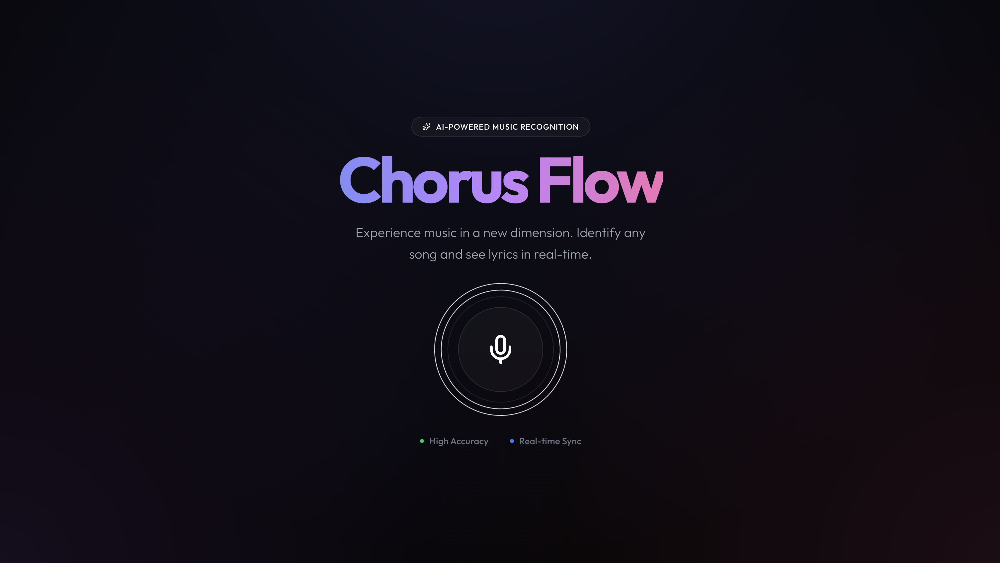
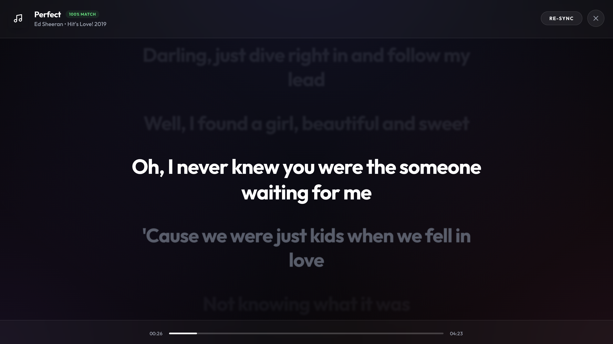

# Chorus Flow 🎵

[**🚀 Live Demo**](https://chorus-flow.vercel.app/)

**Chorus Flow** is an immersive web application that transforms the way you experience music. By leveraging advanced audio recognition technology, it listens to the music playing around you, identifies the track in real-time, and displays synchronized lyrics that flow beautifully with the beat. Designed with a premium, glassmorphic aesthetic, it provides a seamless and engaging sing-along experience.




## 🎥 Video Demo

<video src="./public/chorus-flow.mov" controls="controls" style="max-width: 100%">
  Your browser does not support the video tag.
</video>

## ✨ Key Features

- **🎶 AI-Powered Music Recognition**: Instantly identifies songs playing in your environment using your device's microphone.
- **🎤 Real-Time Synced Lyrics**: Displays lyrics that scroll and highlight automatically in perfect time with the music.
- **✨ Immersive UI**: Features a modern, dark-themed interface with smooth animations, glassmorphism effects, and dynamic transitions.
- **🎯 Focus Mode**: Keeps the current lyric line front and center, with upcoming lines subtly visible to help you anticipate the flow.
- **⏱️ Smart Progress Tracking**: Visualizes song progress with a sleek, static-cue progress bar and precise timestamps.
- **📱 Responsive Design**: Optimized for a great experience across desktop and mobile devices.

## 🛠️ Tech Stack

- **Core Framework & Language**:
  - **Next.js**: React Framework for the web application.
  - **React**: JavaScript library for building user interfaces.
  - **TypeScript**: Strongly typed programming language that builds on JavaScript.

- **Styling & UI**:
  - **Tailwind CSS**: Utility-first CSS framework for styling.
  - **Framer Motion**: Library for production-ready animations.
  - **Lucide React**: Beautiful & consistent icon library.
  - **clsx** & **tailwind-merge**: Utilities for constructing and merging className strings conditionally.

- **Development Tools**:
  - **ESLint**: Pluggable linting utility for JavaScript and JSX.
  - **PostCSS**: Tool for transforming CSS with JavaScript.

## 🚀 Getting Started

First, run the development server:

```bash
npm run dev
# or
yarn dev
# or
pnpm dev
```

Open [http://localhost:3000](http://localhost:3000) with your browser to see the result.

## 📸 How It Works

1.  **Click to Listen**: Tap the microphone button to start listening to ambient music.
2.  **Identify**: The app captures a sample and identifies the song.
3.  **Sing Along**: Lyrics appear instantly, scrolling in sync with the track.

## 🔮 Future Roadmap

- **📚 Personal Library & History**: Implement user accounts to save identified songs and revisit your listening history.
- **🎧 Streaming Integration**: Connect with Spotify or Apple Music to add discovered tracks directly to your playlists or play them in full.
- **🎤 Karaoke Mode**: A dedicated view optimized for singing along, potentially with pitch detection or vocal removal features.
- **📤 Social Sharing**: Generate beautiful lyric cards to share your favorite lines and song discoveries on social media.

## ☁️ Deployment

The easiest way to deploy your Next.js app is to use the [Vercel Platform](https://vercel.com/new?utm_medium=default-template&filter=next.js&utm_source=create-next-app&utm_campaign=create-next-app-readme).

1.  Push your code to a Git repository.
2.  Import your project into Vercel.
3.  **Important**: Add your environment variables (e.g., API keys) in the Vercel project settings during import.
4.  Click **Deploy**.

Check out the [Next.js deployment documentation](https://nextjs.org/docs/app/building-your-application/deploying) for more details.

## 📄 License

This project is open source and available under the [MIT License](LICENSE).
